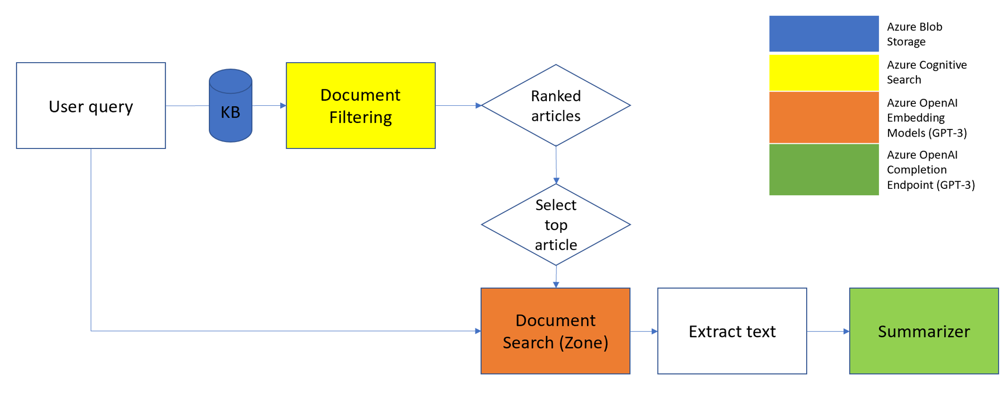

*[**IMPORTANT NOTE** Azure OpenAI is currently in limited public preview. Please request access here https://aka.ms/oaiapply. You will need this access in order to create OpenAI resources and try out the last OpenAI portion of the notebook.]*

This repository contains a Python Notebook that shows you how easy it is to deploy and use Azure OpenAI along with Azure Cognitive Search, Azure Storage and Visual Studio Code to make sense of large amounts of data.

<figcaption align = "center">Figure 1: End-to-end Architecture</figcaption> 

Following are detailed step by step instructions to setup an environment to try out this solution notebook for yourself: 

**I Clone this repository**
  1. Install [git](https://git-scm.com/download/win)
  2. Install the [Visual Studio Code extension for GitHub](https://marketplace.visualstudio.com/items?itemName=GitHub.vscode-pull-request-github)
  3. Open VSCode - close all folders and pick *Clone Git Repository*. 
  4. Clone [https://github.com/Azure-Samples/summarization-python-openai.git](https://github.com/Azure-Samples/summarization-python-openai.git). [NOTE: Cloning might take a while since this pulls down a large dataset file.]

**II Create a Python virtual environment**
  1. Ctrl-Shift-P, then type *Python: Create Environment* (see here for more guidance [Using Python Environments in Visual Studio Code](https://code.visualstudio.com/docs/python/environments#_using-the-create-environment-command))
  2. Pick *venv* and the *Python interpreter*. Wait for the environment to get created, this will also take a while (see the bottom right for status)

**III Run azd up to deploy this solution to Azure**
   1. Install [Azure Developer CLI](https://learn.microsoft.com/en-us/azure/developer/azure-developer-cli/install-azd?tabs=baremetal%2Cwindows) 
   2. In the VSCode Terminal run
~~~ 
az bicep upgrade
azd up
~~~
*[**NOTE**: OpenAI creation will fail if your Azure subscription is not yet whitelisted or if it has more than the number of OpenAI instances allowed per your quota]*

**IV Configure Notebook**
  1. Open the *qbs\_end\_to\_end.ipynb* notebook file in the src folder. Change the environment to the above .venv (top right hand corner, might say *base* or *Select Kernel* or *Python \<version\>*).
  2. Run the cells in the notebook to setup the enviroment until the step where the dataset is uploaded into Storage.   

**V Configure Cognitive Search**
  1. Go to rg-\<environment\> in https://portal.azure.com. Copy Storage Account name (you will need this later)
  2. Go to the Search Service under the rg-<environment> resource group. Select Keys and check Role-based access control
  3. Return to Search Service page. Click Import data and fill in the settings as below
~~~
Data Source: Azure Blob Storage
Data Source Name: azureblob-index
Data to extract: Content and metadata
Parsing mode: JSON array
Connection string - Choose an existing connection - Storage Account (copied above) - Container (openaiblob)
~~~
4. (Click Next then ...) Skip to Customize target index. Check the fields id/article/highlights making all 3 retrievable and the latter 2 searchable.
5. Create indexer and Submit. 

**VI Query based summarization**
1. Run cells in the notebook that use Cognitive Search
2. [Optional] Run cells that use OpenAI (if you have access to the preview)

**VII [Optional] Cleanup**
  1. Go to rg-\<environment\> in https://portal.azure.com. 
  2. Select the OpenAI Service under the rg-<environment> resource group. Click on *Deploy* (or *Model Deployments* on the left side of the page)
  4. Click on each deployed model and select delete. Wait for one deletion to complete before deleting the next one.
  5. Return to rg-\<environment\> page. Click Delete and fill in the name of the resource group and click delete.